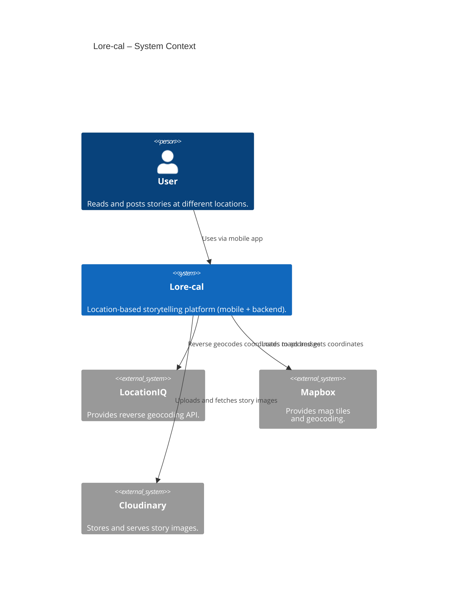
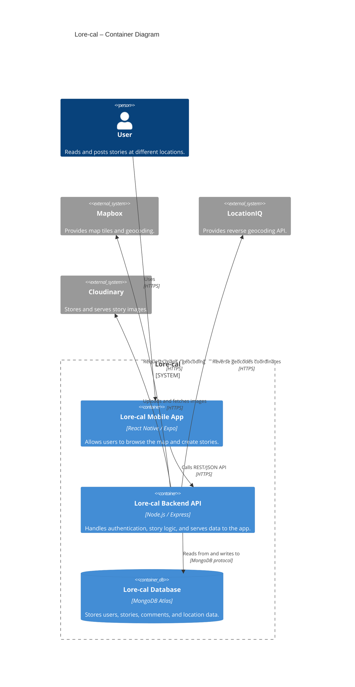
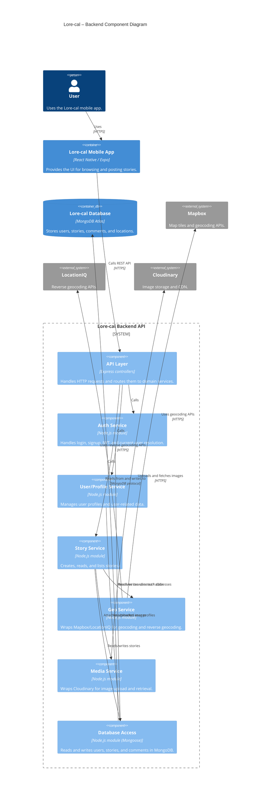
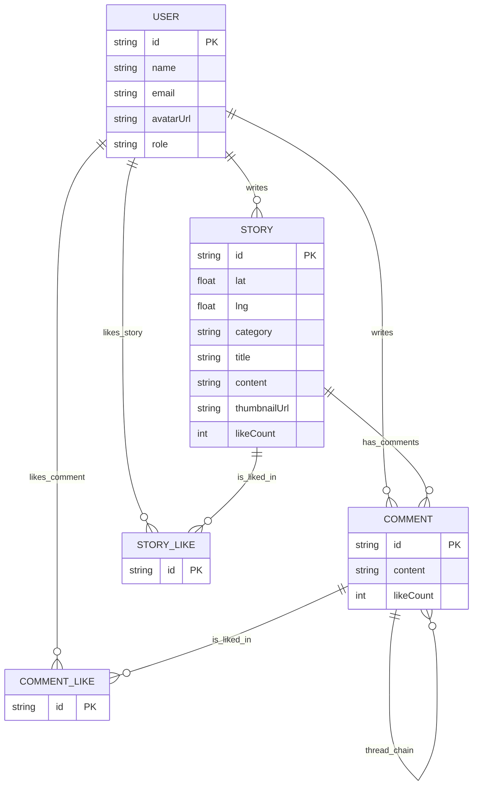
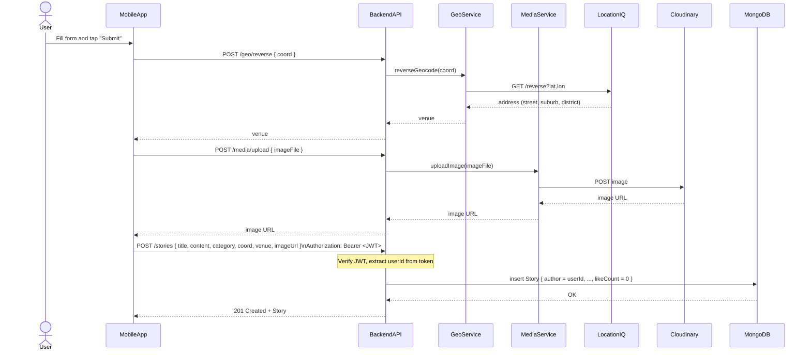

# Lore-cal

## What is this app?

Lore-cal is a location-based social app for sharing short stories tied to real places. Every post (“Story”) must be pinned to a specific point on the map, so users explore what has happened around them: local history, hidden spots, personal memories, or everyday scenes. The app is designed to encourage people to discover the city by walking through it, not by endlessly scrolling a feed.

## Features

### Implemented

- Location-anchored stories
    - Users create stories that must be pinned to a map location.
    - Stories can be tagged as `Historic`, `Anecdotal`, `HiddenGem`, or `Memorable`.
    - Each story has a comment thread for discussion.

- Map-based feed
    - Shows story pins around the user’s current location.

- User profiles and “turf” map
    - Each user has a profile showing a map of locations where they have posted.
    - The system calculates the user’s main “turf” (areas where they post most frequently) and displays it on their profile.

### Planned

- Ephemeral stories
    - 24-hour stories for lightweight, in-the-moment posts.

- Following and filtered map
    - Users can follow other users and view a map filtered to stories from accounts they follow.

- Curated exploration feed
    - Instead of ranking stories by popularity, the app surfaces districts to explore each day to encourage offline exploration.

## Tech stack

- Mobile app
    - Expo (React Native, TypeScript)
    - @rnmapbox/maps for map rendering and user location
    - TanStack Query (React Query) for client-side caching and data fetching
    - expo-router for file-based routing

- Backend API
    - Node.js, Express
    - MongoDB with Mongoose ODM
    - JWT for authentication
    - Render for hosting

- Infrastructure and services
    - Cloudinary for image hosting
    - Mapbox for map tiles and styles
    - LocationIQ APIs for reverse geocoding

- Tooling
    - TypeScript, ESLint, Prettier
    - Git and GitHub for version control

## Running the app

The project consists of a backend API and a mobile app. Run the backend first, then start the mobile app and point it at the API URL.

### 1. Backend API

1. Clone the backend repository:

    ```bash
    git clone https://github.com/wpwcbc/Lore-cal_BACK.git
    cd Lore-cal_BACK
    ```

2. Install dependencies:

```
npm install
```

3. Configure environment variables:

Copy .env.example to .env
Set values for:

- PORT (e.g. 4000)
- MONGODB_URI
- CLOUDINARY\_\* keys
- JWT\_\* secrets
- Any other required variables

4. Start the API server:

```
npm run dev
```

The API will be available at http://localhost:4000 (or the PORT you configured).

### 2. Mobile app (Expo)

1. Clone the mobile app repository:

```
git clone https://github.com/wpwcbc/Lore-cal_FRONT.git
cd Lore-cal_FRONT
```

2. Install dependencies:

```
npm install
```

3. Configure environment variables:

Copy .env.example to .env, or create .env.
Set:

- EXPO_PUBLIC_API_BASE_URL (e.g. http://localhost:4000)
- EXPO_PUBLIC_MAPBOX_ACCESS_TOKEN
- EXPO_PUBLIC_MAPBOX_STYLE
- Any other required variables

4. Run the app:

- Start the Expo dev server:

```
npx expo start
```

- Or run directly on an emulator / device:

```
npx expo run:android
# or
npx expo run:ios
```

Make sure the device/emulator can reach your backend URL (e.g. use your machine’s LAN IP instead of localhost when testing on a real device).

## Documentation

### Architecture Overview - C4 Model

#### 1. System Context

At the highest level, Lore-cal is a single location-based storytelling system used by people to read and post stories tied to real-world locations. The system relies on three external services: LocationIQ for reverse geocoding coordinates into human-readable addresses, Mapbox for map tiles and geocoding, and Cloudinary for storing and serving story images.



#### 2. Container View

Lore-cal is split into a React Native mobile app, a Node.js/Express backend API, and a MongoDB Atlas database. The mobile client talks only to the backend over HTTPS, while the backend is responsible for all data persistence and integrations with external providers: Mapbox for map tiles and geocoding, LocationIQ for reverse geocoding, and Cloudinary for image storage and delivery.



#### 3. Component View

The Lore-cal backend is split into a thin API layer of Express controllers and a set of domain services. The mobile app calls the API layer, which delegates to dedicated components for authentication, user profiles, stories, geolocation, and media handling; these services encapsulate all access to external providers (LocationIQ, Mapbox, Cloudinary) and the MongoDB database via a shared database access module, keeping cross-cutting concerns like data persistence and third-party integrations out of the controllers.



### Data modelling - ER Diagram

The core Lore-cal data model consists of users, stories, comments, and like records. Users write stories and comments; each story can have many comments, and likes are stored as separate join documents so that users can like both stories and individual comments while preserving one-like-per-user-per-target.



### User Action Sequence - Sequence Diagram

#### 1. User posting a Story

When a user creates a story, the mobile app first sends the coordinates to the backend to reverse-geocode them via LocationIQ and get a human-readable venue. It then uploads the selected image to the backend, which forwards it to Cloudinary and returns an image URL. Finally, the app submits the story data (title, content, category, coord, venue, imageUrl) to the backend with a JWT; the backend verifies the token, derives the author from it, and saves the new story in MongoDB with likeCount = 0 before returning the created story to the app.


